# Honest Reviews
[Honest Reviews Live Link](https://intense-shore-50682.herokuapp.com/)

## Overview
HonestReviews is a website for users to find honest, up-to-date information on schools they might be interested in attending.

## Features
- User Login and Authentication
- Creating a review for a school
- Ability to update and delete a review
- View reviews other users have left

## Steps To Run Application:

### Local Host
1. `git clone` the repository
2. `cd` into the repository
3. run $ `yarn` to install React dependencies
4. run $ `bundle` to install Ruby dependencies
5. run $ `rails db:reset` to setup PostgreSQL
6. run $ `rails s` to start local server
7. Open `localhost:3000` on your internet browser
8. Create an account
9. Create reviews!

### Testing
- `yarn jest`
- `rspec spec/models/filename`
- `rspec spec/requests/filename`

## Built With
- React
- Ruby on Rails
- Yarn
- JavaScript
- PostgreSQL
- Active Record
- Heroku

## Dependencies
- "@babel/preset-react": "^7.18.6",
- "@rails/activestorage": "^7.0.3-1",
- "@rails/ujs": "^7.0.3-1",
- "@rails/webpacker": "5.4.3",
- "babel-plugin-transform-react-remove-prop-types": "^0.4.24",
- "jest": "^28.1.3",
- "prop-types": "^15.8.1",
- "react": "^18.2.0",
- "react-dom": "^18.2.0",
- "react-router-dom": "5.3.3",
- "react_ujs": "^2.6.2",
- "reactstrap": "^9.1.3",
- "webpack": "^4.46.0",
- "webpack-cli": "^3.3.12"
- "enzyme": "^3.11.0",
- "enzyme-adapter-react-16": "^1.15.6",
- "react-test-renderer": "^18.2.0",
- "webpack-dev-server": "^3"

## Architecture

### Wireframing
1. Header Unprotected

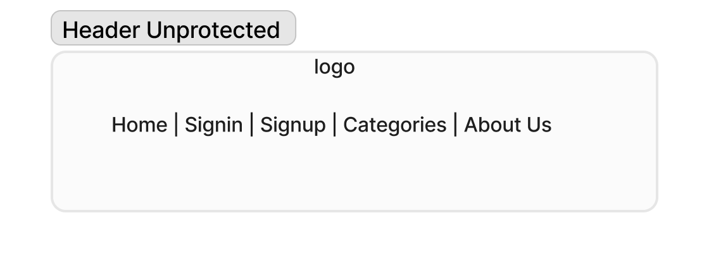

2. Header Protected

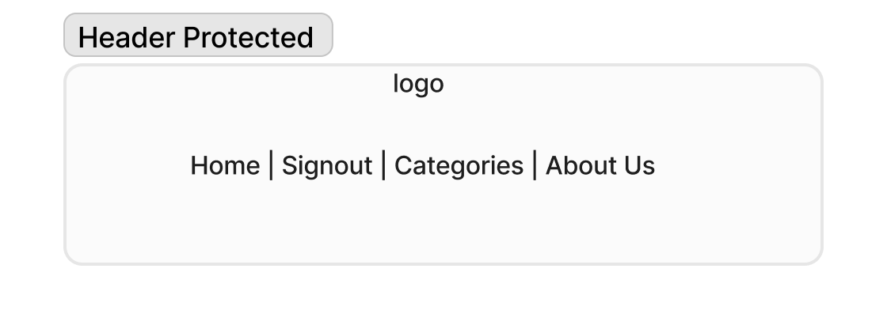

3. Home Page

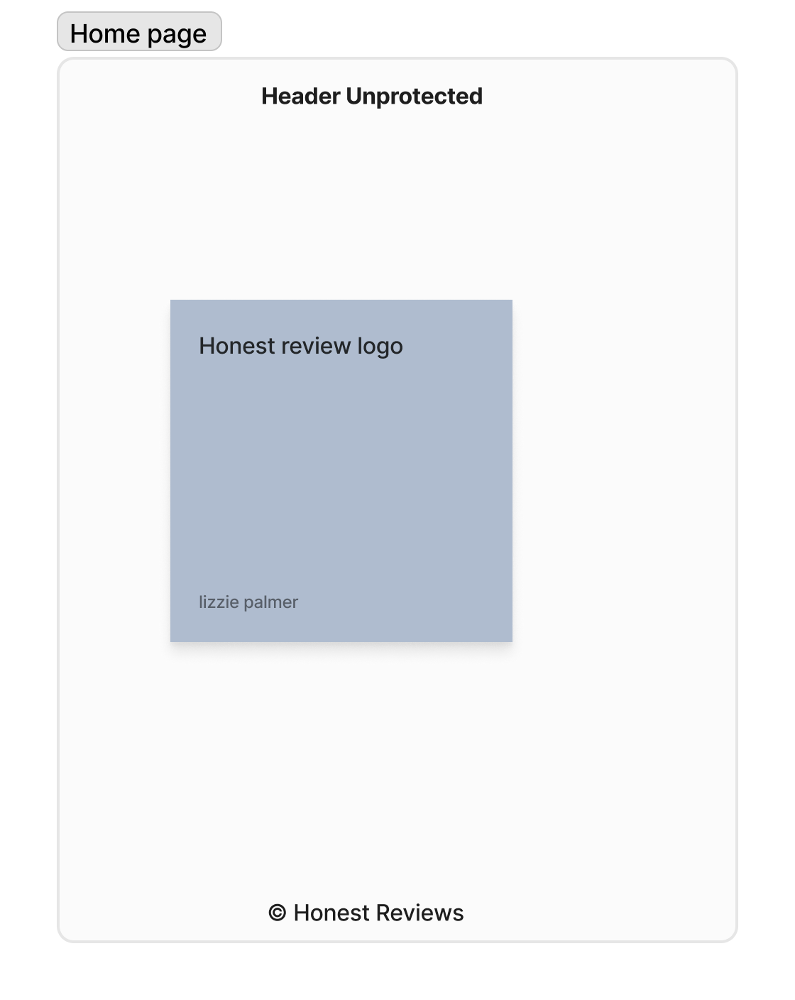

4. Sign-in Page

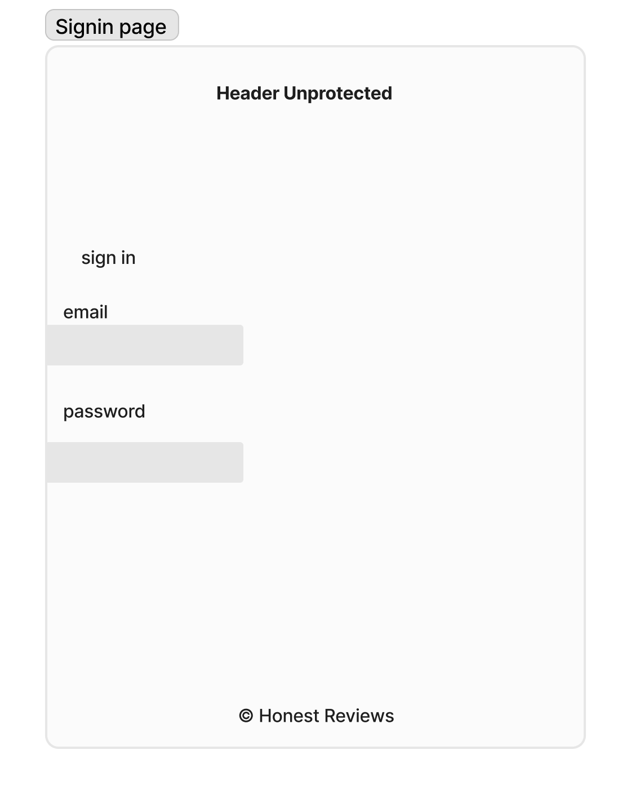

5. Sign-Up Page

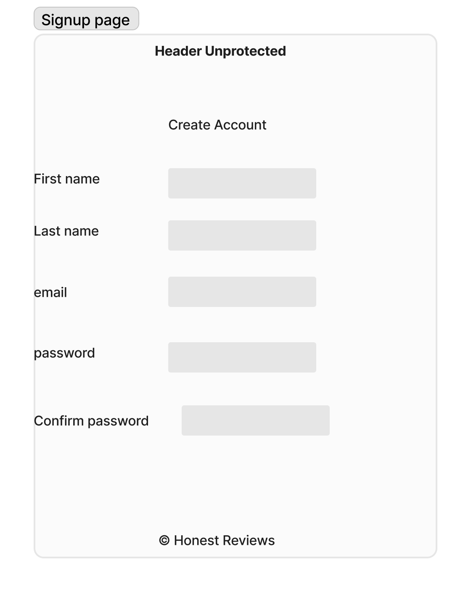

6. Create School Page

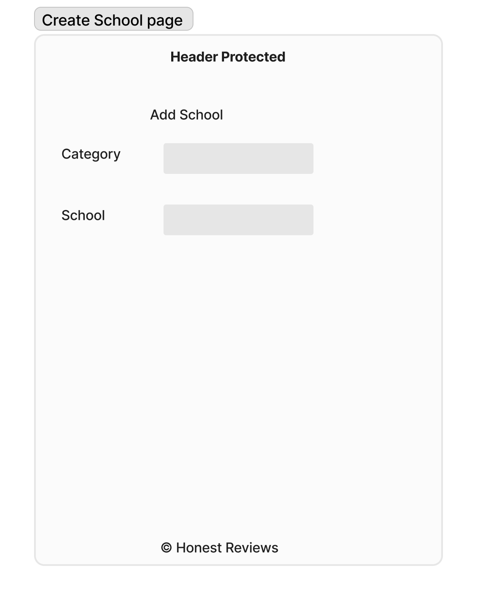

7. View Schools Page

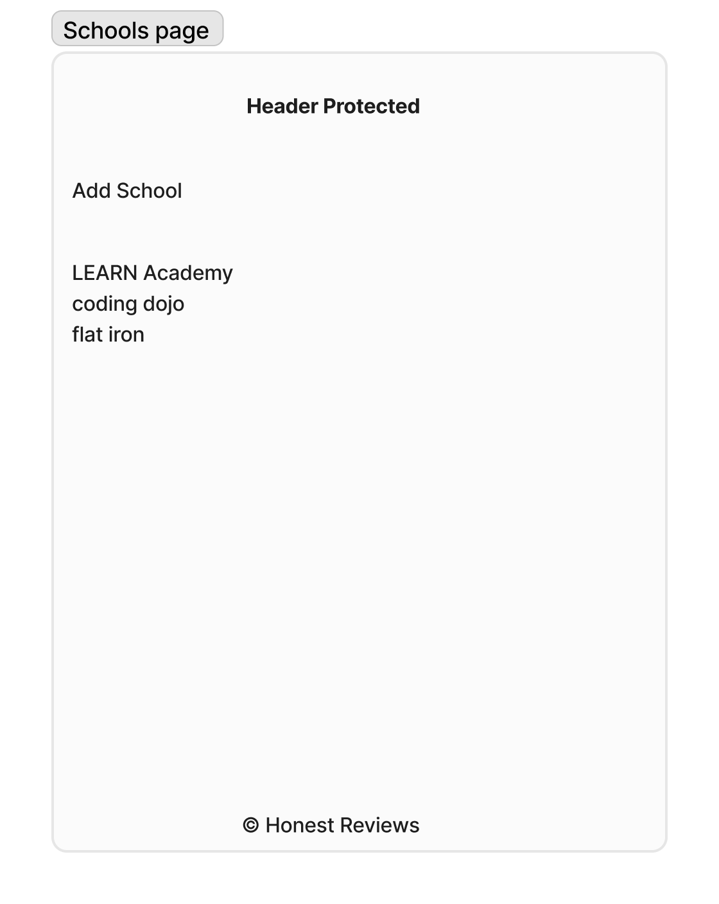

8. Create Review Page

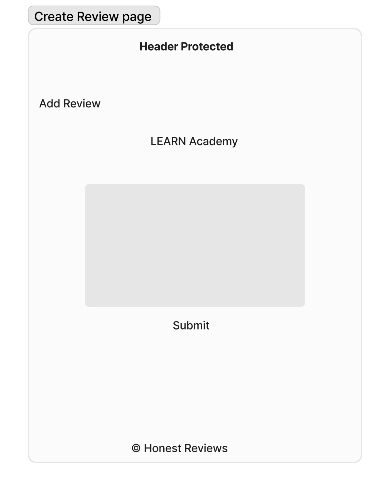

9. View Reviews Page

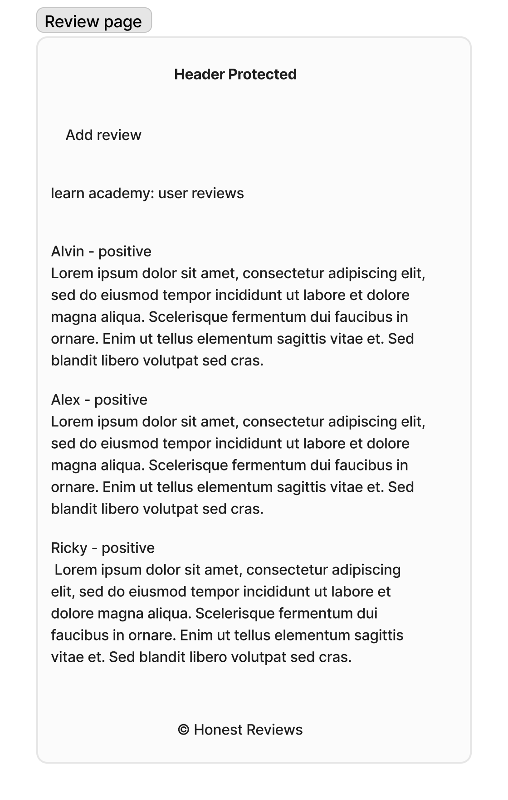

10. Edit/Update/Delete Page

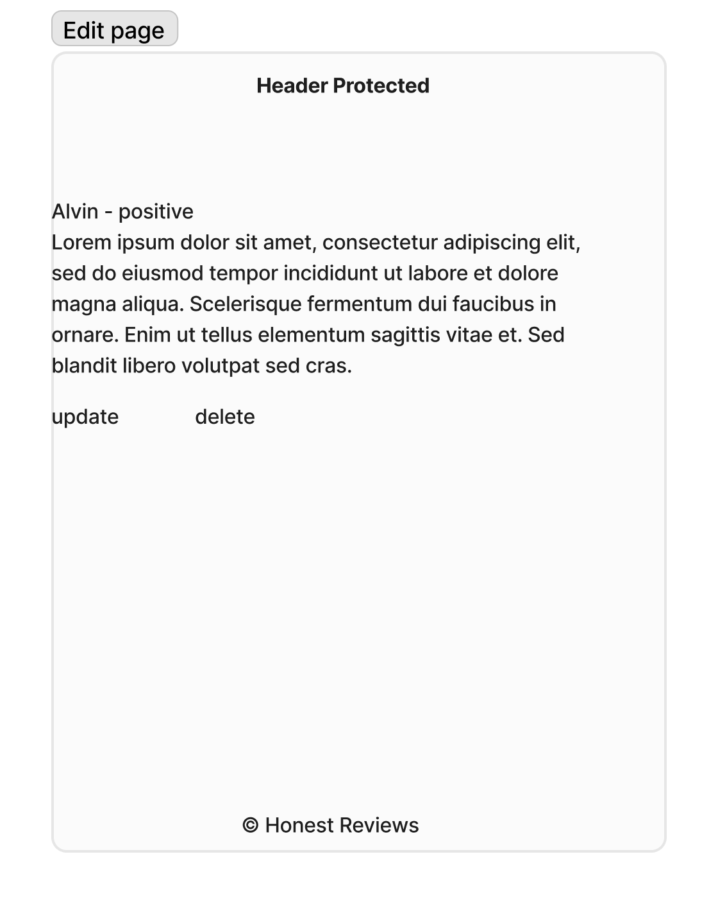

11. About Us

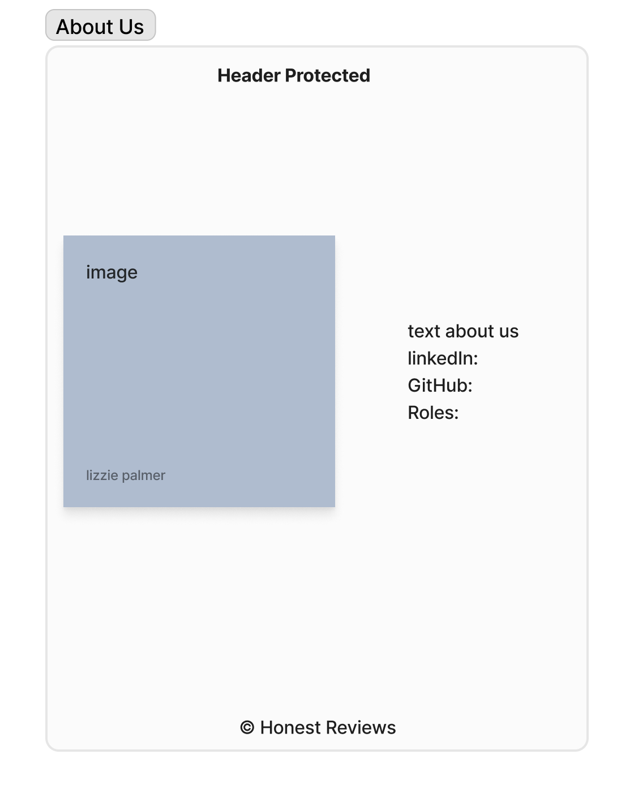

12. Not Found

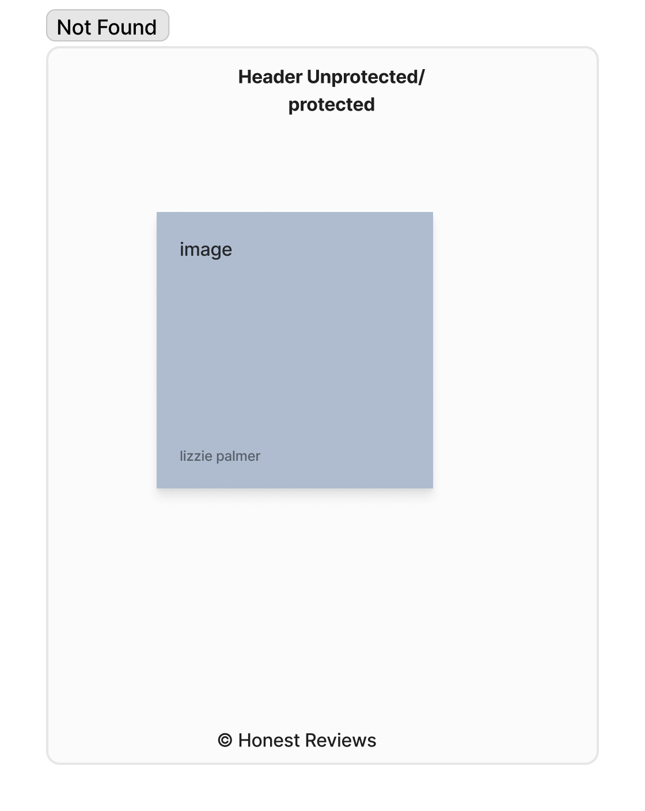

### Database Schema

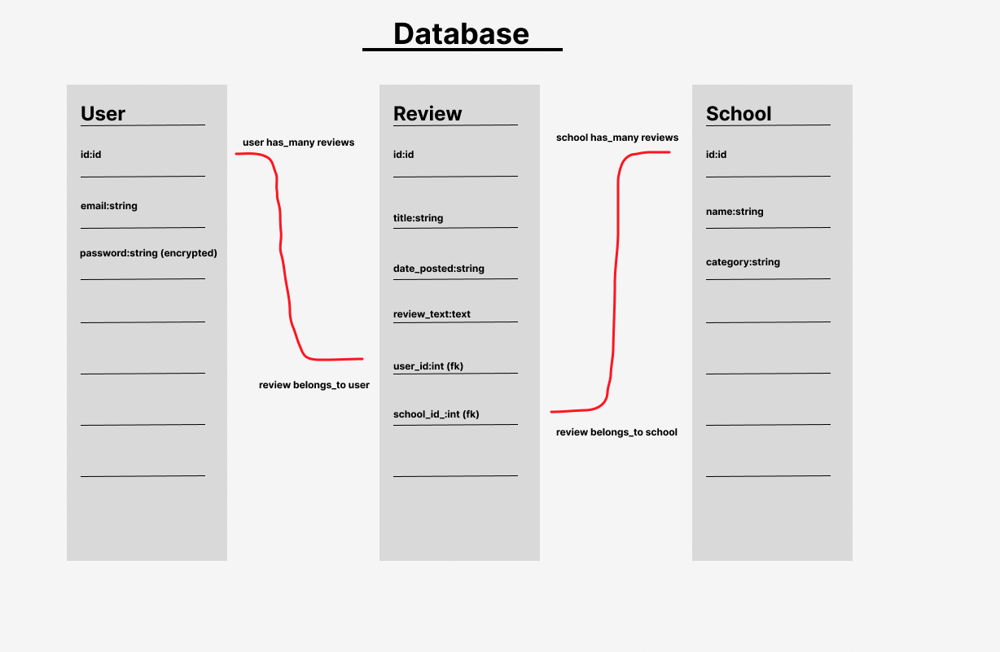

### Contributors

- Venessa Palmer - Design Lead
    - [GitHub](https://github.com/VenessaSP)
    - [LinkedIn](https://www.linkedin.com/in/venessa-palmer-855038225/)
- Alvin Accad - Project Manager
    - [GitHub](https://github.com/alvingithub1)
    - [LinkedIn](https://www.linkedin.com/in/alvin-a-a1b826189/)
- Alex Ballou - Product Manager
    - [GitHub](https://github.com/necessities)
    - [LinkedIn](https://www.linkedin.com/in/alexander-ballou/)
- Ricky Fort - Tech Lead
    - [GitHub](https://github.com/AriseSon)
    - [LinkedIn](https://www.linkedin.com/in/ariseson/)

## Credit and Collaborations
- [Figma](https://figma.com/) for initial wireframing
- [Trello](https://trello.com/) for project management
- [LEARN Academy](https://github.com/learn-academy-2022-delta/Syllabus) for general guidance
- LEARN Staff
    - Elyse Montano
    - Tricia Sykes
    - Sarah Proctor
- Mentor: Erik Guzman
